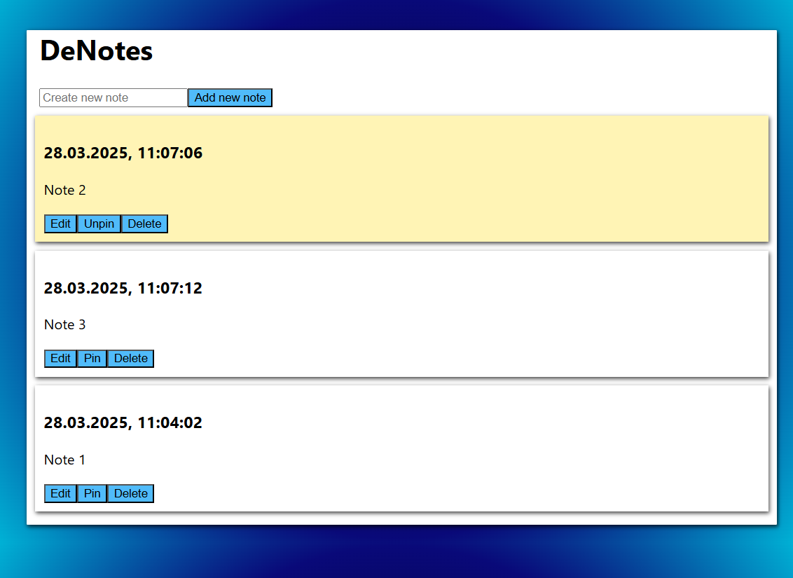

# `de-notes`

DeNotes is a simple decentralized application created on the Internet Computer Protocol. It allows users to create and manage notes using their Internet Identity.

## Running the project

### Mainnet

This project is currently deployed to Mainnet. To try it, [click here](https://jngtt-6qaaa-aaaae-qczma-cai.icp0.io/).

Front-end canister: https://jngtt-6qaaa-aaaae-qczma-cai.icp0.io/

Back-end canister with Candid interface: https://a4gq6-oaaaa-aaaab-qaa4q-cai.raw.icp0.io/?id=iaix5-ryaaa-aaaae-qczlq-cai


### Clone the repository 
```bash
git clone https://github.com/AMykolaD/de-notes.git
cd de-notes
```

### Deploy

npm:


```bash
npm install
```

Deploy the project in playground:

```bash
dfx deploy --playground
```

Or deploy locally:

```bash
# Might not work at the moment, better use playground

dfx start --background
dfx deploy
```

## Usage

Open the app in your browser and log in with your Internet Identity.

After that, you may:
* Check the list of your notes
* Add new notes
* Edit notes
* Pin notes
* Delete notes



## Used technologies
* Front-end: React
* Back-end: Rust

